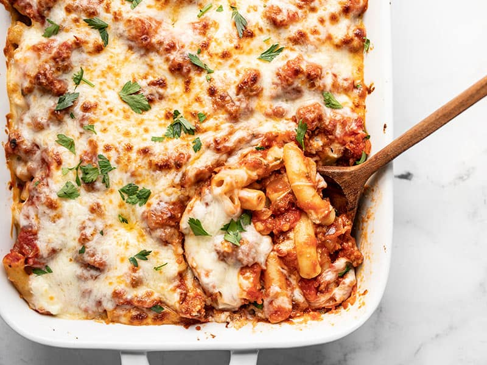

## Ingredients

- 1 pound ziti (can sub penne) pasta
- Extra virgin olive oil
- 1 pound bulk Italian sausage or ground beef or pork
- 1 large onion, chopped
- 3-4 garlic cloves, chopped
- 1 tablespoon fresh rosemary (or basil), minced
- 1 tablespoon Italian seasoning
- 1/2 teaspoon red pepper flakes
- 1 large jar of marinara sauce (about 32 ounces) or make your own tomato sauce
- 1/2 pound of mozzarella cheese, grated or shredded
- 1 heaping cup of ricotta cheese
- 1 cup grated parmesan or pecorino cheese

## Directions

1. Boil the pasta: Heat a large pot of water (2 quarts of water) to a strong boil. Add a tablespoon of salt. Add the pasta and cook at a rolling boil, uncovered, until the pasta is al dente—edible but still a little firm to the bite. Drain the pasta through a colander. Toss with a little olive oil so the pasta does not stick together while you make the sauce.

2. Brown the meat: While the water is heating in the previous step, start on the sauce. Heat a tablespoon of olive oil in a large sauté pan on medium-high heat. When the oil is shimmering hot, add the bulk sausage or ground meat. Break up any large chunks of sausage as it cooks. Brown well Don't stir that often or it will be more difficult for the meat to brown. If you are using ground beef or pork instead of sausage, sprinkle with a little salt.

3. Add onions and sauté, then add garlic, spices, then tomato sauce: When the meat is mostly browned, add the onions and stir well to combine. Sauté everything until the onions are translucent and beginning to brown, about 4-5 minutes. Add the garlic, rosemary or basil, Italian seasoning and red pepper flakes and stir to combine. Cook 1 minute, then add the tomato sauce and stir well. Bring to a simmer.

4. Preheat the oven to 350°F.

5. Layer sauce, cheese, pasta in casserole dish: Spread a thin layer of sauce in the bottom of a 9x13-inch casserole pan, then dot the surface with half the ricotta cheese. Ladle a spoonful of sauce into the pasta, stir it well and then add the pasta into the casserole. Pour the rest of the sauce over the pasta, dot the remaining ricotta cheese over the pasta, and sprinkle on top both the mozzarella and the Parmesan cheese.

6. Bake 20 min: Bake in oven at 350°F until the top is lightly browned and the cheese melted, about 20 minutes.

